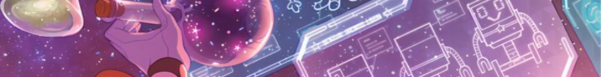

<!-- Header -->

<!-- Username -->

<!-- Id, followers, repos -->

  

  
  
  
  

  
  
  
  

<!-- Desc -->

#

 

<!-- Gif -->

<!-- GitHub Performance -->

  <h4>&nbsp;&nbsp;&nbsp;&nbsp;&nbsp;&nbsp;GitHub Performance</h4>

  &nbsp;&nbsp;&nbsp;&nbsp;&nbsp;&nbsp;&nbsp;&nbsp;&nbsp;&nbsp;&nbsp;&nbsp;
  

  &nbsp;&nbsp;&nbsp;&nbsp;&nbsp;&nbsp;&nbsp;&nbsp;&nbsp;&nbsp;&nbsp;&nbsp;
  

  &nbsp;&nbsp;&nbsp;&nbsp;&nbsp;&nbsp;&nbsp;&nbsp;&nbsp;&nbsp;&nbsp;&nbsp;
  
  

<!-- https://custom-icon-badges.demolab.com/github/stars/marsdevx?color=0D1116&style=for-the-badge&labelColor=0D1116&logo=star&logoColor=yellow -->
<!-- https://komarev.com/ghpvc/?username=marsdevx&abbreviated=true -->
<!-- https://github-readme-stats.vercel.app/api?username=marsdevx -->

<!-- Find Me Online -->

  <h4>&nbsp;&nbsp;&nbsp;&nbsp;&nbsp;&nbsp;Find Me Online</h4>

  &nbsp;&nbsp;&nbsp;&nbsp;&nbsp;&nbsp;&nbsp;&nbsp;&nbsp;&nbsp;&nbsp;&nbsp;
  

  &nbsp;&nbsp;&nbsp;&nbsp;&nbsp;&nbsp;&nbsp;&nbsp;&nbsp;&nbsp;&nbsp;&nbsp;
  

  &nbsp;&nbsp;&nbsp;&nbsp;&nbsp;&nbsp;&nbsp;&nbsp;&nbsp;&nbsp;&nbsp;&nbsp;
  

 
 

#

<!-- Star and follow -->
<h1 align="center">If you like my work, don’t forget to ⭐ star and follow!</h1>